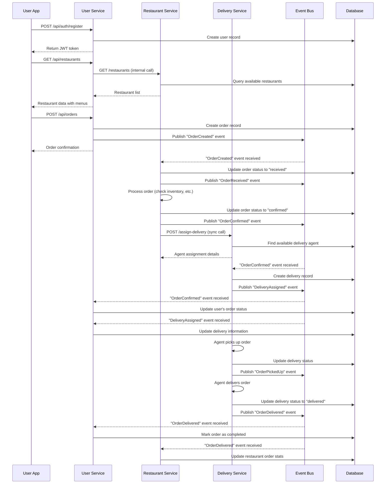
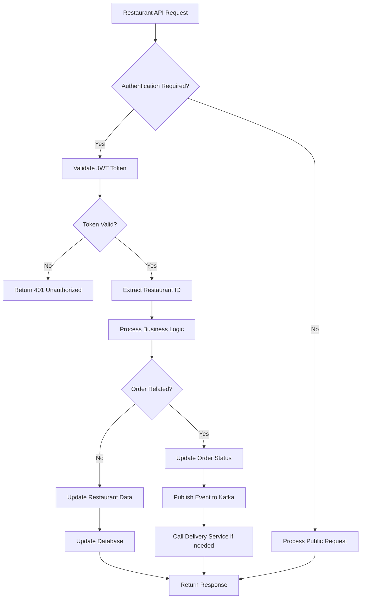
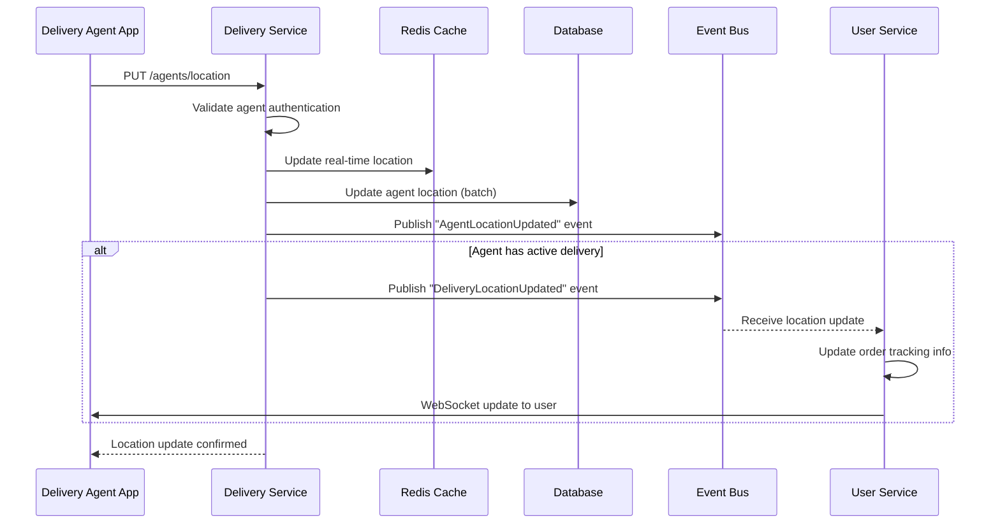
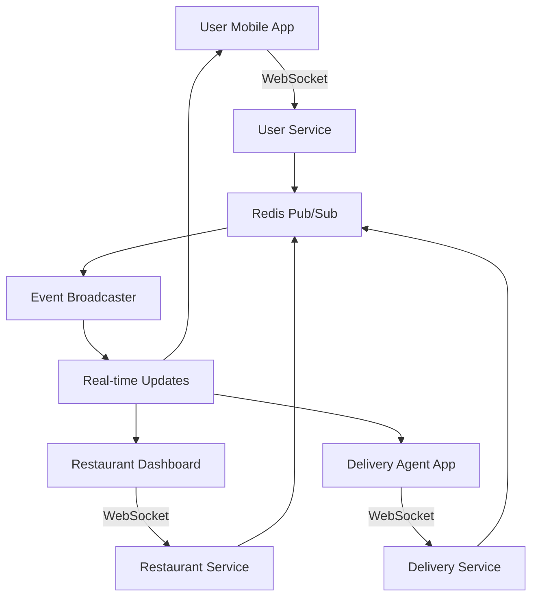
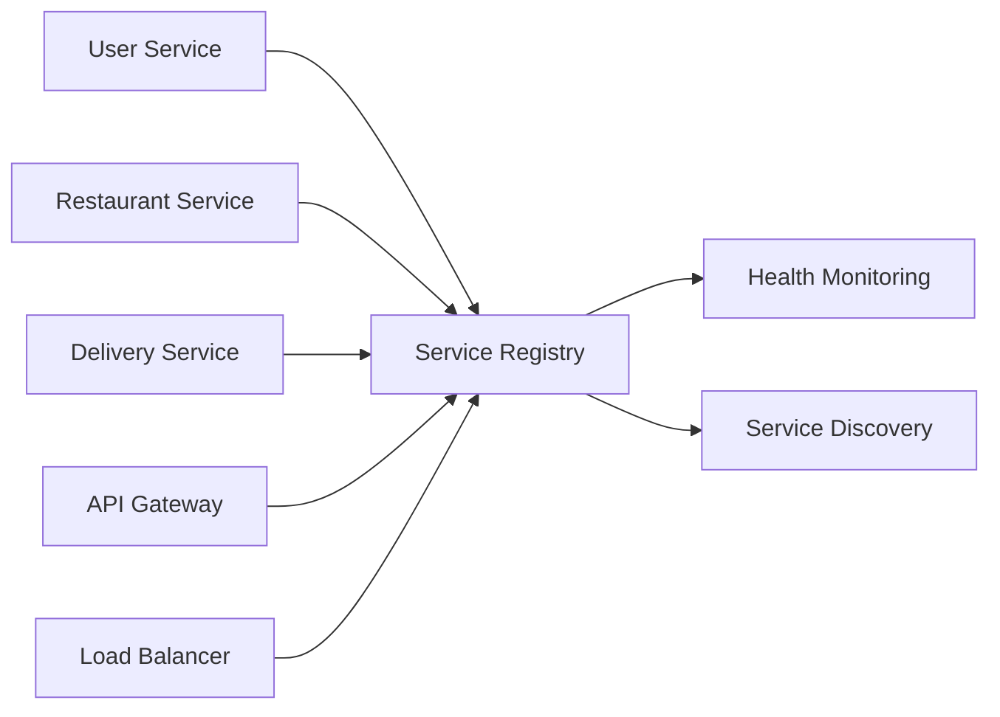

# Food Delivery Backend - System Design Document

## 1. Executive Summary

This document outlines the architecture and design decisions for a scalable food delivery backend system built using microservices architecture. The system consists of three core services: User Service, Restaurant Service, and Delivery Agent Service, each designed to handle specific business domains while maintaining loose coupling through event-driven communication.

## 2. Architecture Overview

### 2.1 Microservices Architecture

The system follows a microservices architecture pattern with the following key principles:

- **Domain-Driven Design**: Each service represents a bounded context
- **Single Responsibility**: Each service has a specific business purpose
- **Loose Coupling**: Services communicate through well-defined APIs and events
- **High Cohesion**: Related functionality is grouped within services
- **Independent Deployment**: Each service can be deployed independently

### 2.2 Service Breakdown

#### 2.2.1 User Service (Port: 3001)
**Responsibilities:**
- User authentication and authorization
- User profile management
- Restaurant discovery and browsing
- Order placement and tracking
- Rating and review submission

**Key Features:**
- JWT-based authentication
- Restaurant search and filtering
- Order management with status tracking
- Rating system for restaurants and delivery agents
- Comprehensive API documentation with Swagger

#### 2.2.2 Restaurant Service (Port: 3002)
**Responsibilities:**
- Restaurant authentication and profile management
- Menu management (CRUD operations)
- Online/offline status management
- Order acceptance/rejection
- Delivery agent assignment

**Key Features:**
- Restaurant dashboard functionality
- Dynamic menu pricing
- Order queue management
- Automatic delivery agent assignment
- Real-time status updates

#### 2.2.3 Delivery Agent Service (Port: 3003)
**Responsibilities:**
- Delivery agent authentication and profile management
- Location tracking and updates
- Delivery status management
- Route optimization support

**Key Features:**
- Real-time location tracking
- Delivery status workflow
- Agent availability management
- Performance metrics tracking

## 6. Technology Stack

### 6.1 Backend Technologies
- **Runtime**: Node.js (v18+)
- **Language**: TypeScript (v5.3+)
- **Framework**: Express.js (v4.18+)
- **Database**: PostgreSQL (v15+)
- **Cache**: Redis (v7+)
- **Message Broker**: Kafka (v2.8+)
- **Validation**: Zod (v3.22+)
- **Documentation**: Swagger/OpenAPI (v3.0)

### 6.2 Infrastructure
- **Containerization**: Docker & Docker Compose
- **Process Management**: PM2 (production)
- **Monitoring**: Winston (logging)
- **Testing**: Jest & Supertest

### 6.3 External Services
- **Maps API**: Google Maps API (for location services)
- **Notifications**: WebSocket/Server-Sent Events
- **File Storage**: AWS S3 (for images)

## 4. API Flow Architecture & Inter-Service Communication

### 4.1 Service Communication Patterns

The system implements multiple communication patterns to ensure efficient and reliable inter-service communication:

#### 4.1.1 Synchronous Communication (HTTP/REST)
- **Direct Service-to-Service Calls**: For immediate response requirements
- **API Gateway Pattern**: Future implementation for routing and load balancing
- **Circuit Breaker**: Implemented to prevent cascading failures

#### 4.1.2 Asynchronous Communication (Event-Driven)
- **Event Publishing**: Services publish domain events to Kafka
- **Event Subscription**: Services subscribe to relevant events from other domains
- **Message Queues**: For reliable message delivery and processing

### 4.2 Detailed API Flow Diagrams

#### 4.2.1 Complete Order Flow (End-to-End)



#### 4.2.2 Restaurant Service Internal Flow



#### 4.2.3 Delivery Agent Location Update Flow



### 4.3 Inter-Service API Contracts

#### 4.3.1 User Service ↔ Restaurant Service

**User Service calls Restaurant Service:**
```typescript
// Get available restaurants
GET /restaurants
Response: Restaurant[]

// Get restaurant menu
GET /restaurants/{id}/menu
Response: MenuItem[]

// Internal order status sync
POST /internal/orders/{orderId}/status
Body: { status: OrderStatus, updatedBy: 'user-service' }
```

#### 4.3.2 Restaurant Service ↔ Delivery Service

**Restaurant Service calls Delivery Service:**
```typescript
// Request delivery agent assignment
POST /assign-delivery
Body: {
  orderId: string,
  restaurantLocation: Location,
  deliveryAddress: string,
  orderValue: number
}
Response: {
  agentId: string,
  estimatedTime: number,
  agentLocation: Location
}

// Get delivery status
GET /deliveries/{orderId}/status
Response: DeliveryStatus
```

#### 4.3.3 Delivery Service ↔ User Service

**Delivery Service calls User Service:**
```typescript
// Notify order status change
POST /internal/orders/{orderId}/delivery-update
Body: {
  status: DeliveryStatus,
  agentLocation?: Location,
  estimatedTime?: number
}

// Get user contact info for delivery
GET /internal/users/{userId}/contact
Response: {
  phone: string,
  address: string,
  name: string
}
```

### 4.4 Event-Driven Communication Schema

#### 4.4.1 Event Types and Payloads

```typescript
// Order Events
interface OrderCreatedEvent {
  eventType: 'OrderCreated';
  orderId: string;
  userId: string;
  restaurantId: string;
  items: OrderItem[];
  totalAmount: number;
  deliveryAddress: string;
  timestamp: Date;
}

interface OrderConfirmedEvent {
  eventType: 'OrderConfirmed';
  orderId: string;
  restaurantId: string;
  estimatedPrepTime: number;
  timestamp: Date;
}

// Delivery Events
interface DeliveryAssignedEvent {
  eventType: 'DeliveryAssigned';
  orderId: string;
  agentId: string;
  agentLocation: Location;
  estimatedDeliveryTime: number;
  timestamp: Date;
}

interface OrderDeliveredEvent {
  eventType: 'OrderDelivered';
  orderId: string;
  agentId: string;
  deliveredAt: Date;
  customerSignature?: string;
}
```

#### 4.4.2 Event Subscription Matrix

| Service | Publishes | Subscribes To |
|---------|-----------|---------------|
| User Service | `OrderCreated`, `OrderCancelled`, `PaymentCompleted` | `OrderConfirmed`, `DeliveryAssigned`, `OrderDelivered` |
| Restaurant Service | `OrderReceived`, `OrderConfirmed`, `OrderReady` | `OrderCreated`, `OrderCancelled` |
| Delivery Service | `DeliveryAssigned`, `OrderPickedUp`, `OrderDelivered` | `OrderConfirmed`, `OrderReady` |

### 4.5 Error Handling in Inter-Service Communication

#### 4.5.1 Synchronous Call Error Handling
```typescript
// Circuit breaker pattern implementation
async function callRestaurantService(endpoint: string, data: any) {
  try {
    const response = await axios.post(`${RESTAURANT_SERVICE_URL}${endpoint}`, data, {
      timeout: 5000,
      retry: 3,
      retryDelay: 1000
    });
    return response.data;
  } catch (error) {
    // Log error and implement fallback
    logger.error('Restaurant service call failed', { endpoint, error });
    
    if (error.code === 'ECONNREFUSED') {
      // Service is down, use cached data or return error
      throw new ServiceUnavailableError('Restaurant service temporarily unavailable');
    }
    
    throw error;
  }
}
```

#### 4.5.2 Asynchronous Event Error Handling
```typescript
// Dead letter queue for failed events
interface EventProcessingConfig {
  maxRetries: 3;
  retryDelay: [1000, 5000, 15000]; // exponential backoff
  deadLetterTopic: 'failed-events';
}

// Event handler with retry logic
async function handleOrderCreatedEvent(event: OrderCreatedEvent) {
  try {
    await processOrderCreation(event);
  } catch (error) {
    await retryEventProcessing(event, error);
  }
}
```

### 4.7 Real-Time Communication Architecture

#### 4.7.1 WebSocket Implementation


#### 4.7.2 Real-Time Event Flow
```typescript
// Real-time event broadcasting
interface RealTimeEvent {
  type: 'order_status_update' | 'delivery_location_update' | 'agent_assigned';
  target: 'user' | 'restaurant' | 'agent';
  targetId: string;
  payload: any;
  timestamp: Date;
}

// WebSocket event dispatcher
class RealTimeEventDispatcher {
  async broadcastToUser(userId: string, event: RealTimeEvent) {
    const userSocket = this.userConnections.get(userId);
    if (userSocket?.connected) {
      userSocket.emit(event.type, event.payload);
    }
    
    // Fallback to push notification if not connected
    await this.pushNotificationService.send(userId, event);
  }
}
```

### 4.8 Service Discovery and Health Monitoring

#### 4.8.1 Health Check Implementation
```typescript
// Health check endpoint for each service
app.get('/health', (req, res) => {
  const healthCheck = {
    status: 'OK',
    service: process.env.SERVICE_NAME,
    port: process.env.PORT,
    timestamp: new Date().toISOString(),
    uptime: process.uptime(),
    dependencies: {
      database: await checkDatabaseConnection(),
      redis: await checkRedisConnection(),
      kafka: await checkKafkaConnection()
    }
  };
  
  const hasUnhealthyDependency = Object.values(healthCheck.dependencies)
    .some(status => status !== 'healthy');
    
  if (hasUnhealthyDependency) {
    return res.status(503).json({
      ...healthCheck,
      status: 'DEGRADED'
    });
  }
  
  res.status(200).json(healthCheck);
});
```

#### 4.8.2 Service Registry Pattern


### 4.9 API Rate Limiting and Security

#### 4.9.1 Rate Limiting Strategy
```typescript
// Rate limiting per service and endpoint
const rateLimitConfig = {
  '/api/auth/login': { windowMs: 15 * 60 * 1000, max: 5 }, // 5 attempts per 15 min
  '/api/orders': { windowMs: 60 * 1000, max: 10 }, // 10 orders per minute
  '/api/restaurants': { windowMs: 60 * 1000, max: 100 }, // 100 requests per minute
  '/agents/location': { windowMs: 10 * 1000, max: 60 } // 6 location updates per minute
};
```

#### 4.9.2 Inter-Service Authentication
```typescript
// Service-to-service JWT authentication
interface ServiceToken {
  serviceId: string;
  serviceName: string;
  permissions: string[];
  expiresAt: Date;
}

// Internal API authentication middleware
const authenticateServiceCall = (requiredPermission: string) => {
  return async (req: Request, res: Response, next: NextFunction) => {
    const token = req.headers['x-service-token'];
    const decoded = jwt.verify(token, SERVICE_SECRET) as ServiceToken;
    
    if (!decoded.permissions.includes(requiredPermission)) {
      return res.status(403).json({ error: 'Insufficient permissions' });
    }
    
    req.serviceContext = decoded;
    next();
  };
};
```

### 4.10 Data Consistency and Transaction Management

#### 4.10.1 Saga Pattern Implementation
```typescript
// Order processing saga for distributed transactions
class OrderProcessingSaga {
  async executeOrderWorkflow(orderData: CreateOrderRequest) {
    const sagaId = generateSagaId();
    
    try {
      // Step 1: Create order in User Service
      const order = await this.userService.createOrder(orderData, sagaId);
      
      // Step 2: Reserve inventory in Restaurant Service
      await this.restaurantService.reserveItems(order.items, sagaId);
      
      // Step 3: Assign delivery agent
      await this.deliveryService.assignAgent(order.id, sagaId);
      
      // Step 4: Process payment
      await this.paymentService.processPayment(order.payment, sagaId);
      
      // All steps successful - commit saga
      await this.commitSaga(sagaId);
      
    } catch (error) {
      // Compensate for any completed steps
      await this.compensateSaga(sagaId, error);
      throw error;
    }
  }
  
  private async compensateSaga(sagaId: string, error: Error) {
    // Reverse order of operations
    await this.paymentService.refundPayment(sagaId);
    await this.deliveryService.releaseAgent(sagaId);
    await this.restaurantService.releaseItems(sagaId);
    await this.userService.cancelOrder(sagaId);
  }
}
```

#### 4.10.2 Event Sourcing for Order State
```typescript
// Event sourcing for order state management
interface OrderEvent {
  eventId: string;
  orderId: string;
  eventType: OrderEventType;
  eventData: any;
  timestamp: Date;
  version: number;
}

class OrderEventStore {
  async appendEvent(orderId: string, event: OrderEvent) {
    await this.db.transaction(async (trx) => {
      // Append event to event store
      await trx('order_events').insert(event);
      
      // Update order snapshot
      const currentState = await this.getOrderState(orderId, trx);
      const newState = this.applyEvent(currentState, event);
      await trx('order_snapshots').upsert(newState);
    });
    
    // Publish event to other services
    await this.eventBus.publish(event);
  }
}
```

## 5. Database Design

### 5.1 Database Strategy
- **Single Database Approach**: All services share a PostgreSQL database but access only their domain-specific tables
- **Future Consideration**: Database per service for true microservices isolation

### 4.2 Core Tables

#### Users Table
```sql
CREATE TABLE users (
    id UUID PRIMARY KEY DEFAULT gen_random_uuid(),
    email VARCHAR(255) UNIQUE NOT NULL,
    password_hash VARCHAR(255) NOT NULL,
    name VARCHAR(100) NOT NULL,
    phone VARCHAR(20),
    address TEXT,
    created_at TIMESTAMP DEFAULT CURRENT_TIMESTAMP,
    updated_at TIMESTAMP DEFAULT CURRENT_TIMESTAMP
);
```

#### Restaurants Table
```sql
CREATE TABLE restaurants (
    id UUID PRIMARY KEY DEFAULT gen_random_uuid(),
    name VARCHAR(100) NOT NULL,
    email VARCHAR(255) UNIQUE NOT NULL,
    password_hash VARCHAR(255) NOT NULL,
    phone VARCHAR(20),
    address TEXT NOT NULL,
    cuisine_type VARCHAR(50),
    is_online BOOLEAN DEFAULT false,
    rating DECIMAL(3,2) DEFAULT 0.0,
    opening_time TIME,
    closing_time TIME,
    created_at TIMESTAMP DEFAULT CURRENT_TIMESTAMP,
    updated_at TIMESTAMP DEFAULT CURRENT_TIMESTAMP
);
```

#### Menu Items Table
```sql
CREATE TABLE menu_items (
    id UUID PRIMARY KEY DEFAULT gen_random_uuid(),
    restaurant_id UUID REFERENCES restaurants(id) ON DELETE CASCADE,
    name VARCHAR(100) NOT NULL,
    description TEXT,
    price DECIMAL(10,2) NOT NULL,
    category VARCHAR(50),
    is_available BOOLEAN DEFAULT true,
    image_url VARCHAR(255),
    created_at TIMESTAMP DEFAULT CURRENT_TIMESTAMP,
    updated_at TIMESTAMP DEFAULT CURRENT_TIMESTAMP
);
```

#### Orders Table
```sql
CREATE TABLE orders (
    id UUID PRIMARY KEY DEFAULT gen_random_uuid(),
    user_id UUID REFERENCES users(id) ON DELETE CASCADE,
    restaurant_id UUID REFERENCES restaurants(id) ON DELETE CASCADE,
    delivery_agent_id UUID REFERENCES delivery_agents(id),
    status VARCHAR(20) DEFAULT 'pending',
    total_amount DECIMAL(10,2) NOT NULL,
    delivery_address TEXT NOT NULL,
    special_instructions TEXT,
    created_at TIMESTAMP DEFAULT CURRENT_TIMESTAMP,
    updated_at TIMESTAMP DEFAULT CURRENT_TIMESTAMP
);
```

### 4.3 Indexing Strategy
- Primary keys (UUID) with B-tree indexes
- Foreign key indexes for join performance
- Composite indexes for common query patterns
- Partial indexes for filtered queries (e.g., is_online = true)

## 5. Event-Driven Architecture

### 5.1 Kafka Topics

| Topic | Purpose | Producer | Consumer |
|-------|---------|----------|----------|
| `order-placed` | User places new order | User Service | Restaurant Service |
| `order-accepted` | Restaurant accepts order | Restaurant Service | User Service, Delivery Service |
| `order-rejected` | Restaurant rejects order | Restaurant Service | User Service |
| `delivery-assigned` | Delivery agent assigned | Restaurant Service | User Service, Delivery Service |
| `delivery-status-updated` | Delivery status change | Delivery Service | User Service, Restaurant Service |
| `rating-submitted` | User submits rating | User Service | Restaurant Service, Delivery Service |

### 5.2 Event Flow Examples

#### Order Placement Flow
1. User places order → `order-placed` event
2. Restaurant receives notification
3. Restaurant accepts → `order-accepted` event
4. System assigns delivery agent → `delivery-assigned` event
5. Agent updates status → `delivery-status-updated` events
6. Order delivered → User can rate → `rating-submitted` event

## 6. API Design

### 6.1 RESTful API Principles
- Resource-based URLs
- HTTP methods for operations (GET, POST, PUT, DELETE)
- Consistent response format
- Proper HTTP status codes
- Pagination for list endpoints

### 6.2 Response Format
```json
{
  "success": boolean,
  "data": any,
  "message": string,
  "error": string,
  "pagination": {
    "page": number,
    "limit": number,
    "total": number,
    "totalPages": number
  }
}
```

### 6.3 Authentication
- JWT tokens for stateless authentication
- Role-based access control (user, restaurant, delivery_agent)
- Token expiration and refresh mechanism

## 7. Caching Strategy

### 7.1 Redis Usage
- **Session Storage**: User sessions and authentication tokens
- **Data Caching**: Frequently accessed data (restaurant lists, menu items)
- **Rate Limiting**: API rate limiting per user/service
- **Real-time Data**: Order status, delivery tracking

### 7.2 Cache Patterns
- **Cache-Aside**: Application manages cache
- **Write-Through**: Write to cache and database simultaneously
- **TTL Strategy**: Time-based expiration for different data types

## 8. Scalability Considerations

### 8.1 Horizontal Scaling
- **Load Balancing**: Nginx/HAProxy for request distribution
- **Service Scaling**: Independent scaling of each microservice
- **Database Scaling**: Read replicas, connection pooling

### 8.2 Performance Optimization
- **Database Optimization**: Proper indexing, query optimization
- **Caching**: Multi-level caching strategy
- **Async Processing**: Event-driven architecture for non-blocking operations

### 8.3 Future Scalability
- **Database Sharding**: Horizontal partitioning by geography/user
- **CQRS**: Separate read and write models
- **Event Sourcing**: For audit trails and state reconstruction

## 9. Security Considerations

### 9.1 Authentication & Authorization
- JWT tokens with proper expiration
- Role-based access control (RBAC)
- Password hashing with bcrypt

### 9.2 Data Protection
- Input validation with Zod schemas
- SQL injection prevention with parameterized queries
- XSS protection with proper sanitization
- CORS configuration for cross-origin requests

### 9.3 API Security
- Rate limiting to prevent abuse
- HTTPS enforcement in production
- API key management for external services
- Audit logging for sensitive operations

## 10. Monitoring & Observability

### 10.1 Logging Strategy
- **Structured Logging**: JSON format with Winston
- **Log Levels**: ERROR, WARN, INFO, DEBUG
- **Centralized Logging**: ELK stack in production
- **Correlation IDs**: Request tracking across services

### 10.2 Health Checks
- Application health endpoints
- Database connectivity checks
- External service dependency checks
- Kubernetes-ready health probes

### 10.3 Metrics & Monitoring
- **Application Metrics**: Response times, error rates
- **Business Metrics**: Orders per minute, conversion rates
- **Infrastructure Metrics**: CPU, memory, disk usage
- **Alerting**: Automated alerts for critical issues

## 11. Deployment Strategy

### 11.1 Containerization
- Docker containers for each service
- Multi-stage builds for optimization
- Health checks in Dockerfiles
- Security scanning of images

### 11.2 Orchestration
- Docker Compose for local development
- Kubernetes for production deployment
- Service mesh (Istio) for advanced networking

### 11.3 CI/CD Pipeline
- **Continuous Integration**: Automated testing, linting
- **Continuous Deployment**: Automated deployment to staging/production
- **Blue-Green Deployment**: Zero-downtime deployments
- **Rollback Strategy**: Quick rollback capabilities

## 12. Testing Strategy

### 12.1 Testing Pyramid
- **Unit Tests**: Individual functions and methods
- **Integration Tests**: Service interactions and database
- **End-to-End Tests**: Complete user workflows
- **Contract Tests**: API contract validation

### 12.2 Test Automation
- Jest for unit and integration testing
- Supertest for API testing
- Test databases for isolation
- CI/CD integration for automated testing

## 13. Error Handling & Resilience

### 13.1 Error Handling
- Centralized error handling middleware
- Proper HTTP status codes
- User-friendly error messages
- Error logging and tracking

### 13.2 Resilience Patterns
- **Circuit Breaker**: Prevent cascading failures
- **Retry Logic**: Automatic retry with exponential backoff
- **Timeout Management**: Prevent hanging requests
- **Graceful Degradation**: Fallback mechanisms

## 14. Development Guidelines

### 14.1 Code Quality
- TypeScript for type safety
- ESLint and Prettier for code formatting
- Clean Architecture principles
- SOLID design principles

### 14.2 Documentation
- Comprehensive README files
- API documentation with Swagger
- Code comments for business logic
- Architecture decision records (ADRs)

## 15. Future Enhancements

### 15.1 Technical Improvements
- GraphQL API for flexible data fetching
- WebSocket for real-time updates
- Machine learning for recommendations
- Advanced analytics and reporting

### 15.2 Business Features
- Multi-tenant architecture
- International expansion support
- Advanced promotional systems
- Loyalty programs and rewards

## 16. Conclusion

This system design provides a solid foundation for a scalable food delivery platform. The microservices architecture ensures maintainability and scalability, while the event-driven approach enables loose coupling between services. The comprehensive technology stack supports both current requirements and future growth, making this system production-ready and enterprise-grade.
